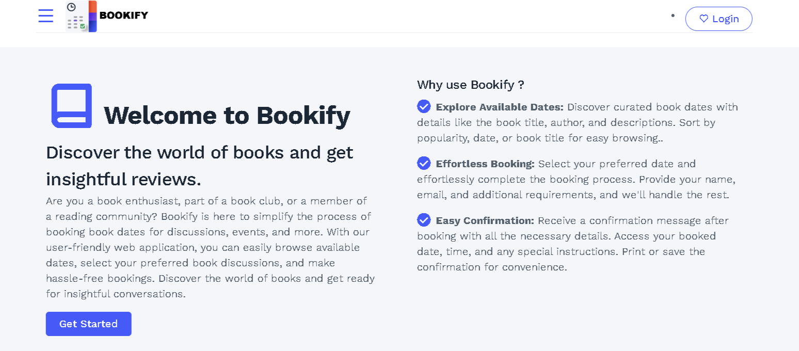
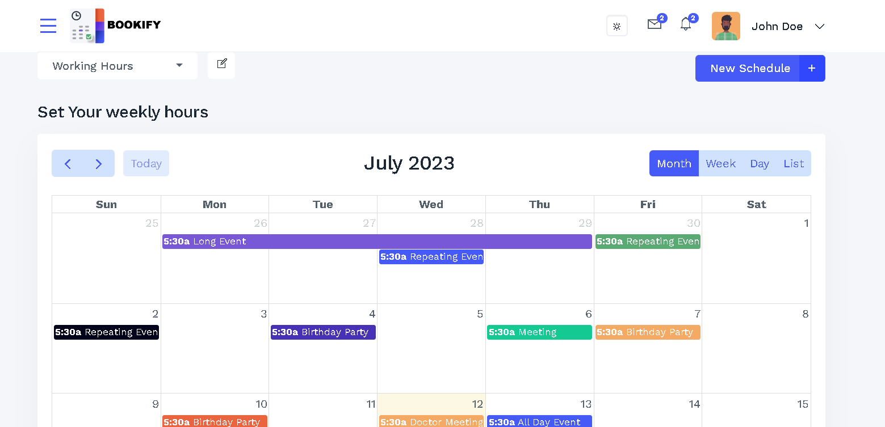
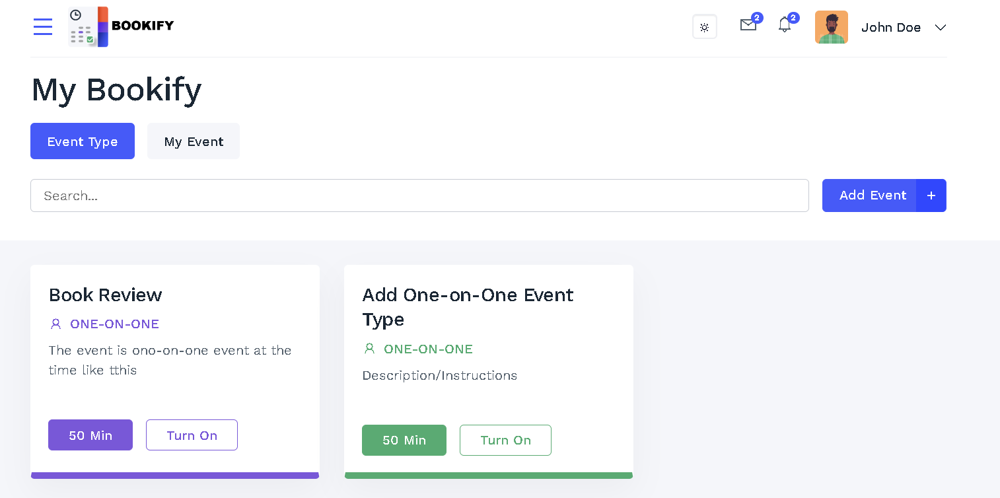

# Bookify

Bookify is a frontend web application that revolutionizes the process of booking book dates. With Bookify, book enthusiasts, clubs, and communities can effortlessly organize book-related events or discussions. This user-friendly application simplifies the entire booking experience by providing a seamless interface for users to browse available dates, select their preferred date, and make bookings with ease. Whether you're planning a literary event or a book club gathering, Bookify streamlines the process, allowing you to focus on what truly matters – bringing people together through the love of books.

## video Introduction Link
https://www.youtube.com/watch?v=XLx-by4Z8JU&t=3s

## Table of Contents
 - Introduction
 - Features
 - Technology Stack
 - Future Enhancements
 - Installation
 - Usage
 - Technologies Used
 - Contributing
 - License

## Features
The MVP version of Bookify includes the following core features:

- Date Listing
Display a list of available book dates, including date, time, and relevant details.
Each date entry shows the title, author, and a brief description of the book being discussed.
Allow users to sort the dates based on popularity, date, or book title.
- Booking
Enable users to select a specific date and proceed with the booking process.
Gather necessary information from the user, such as name, email, and any additional requirements.
Validate user input and display appropriate feedback for successful bookings or any errors that may occur.
- Confirmation
Provide users with a confirmation message after successful booking.
Include relevant details like the booked date, time, and instructions, if any.
Allow users to print or save the confirmation for their records.

## Technologies Stack
Bookify is built using the following technologies:

- Python 3
- Flask web framework
- SQLAlchemy ORM
- Jinja2 template engine
- HTML, CSS, and JavaScript
- Bootstrap front-end framework
- Google authentication API
- AWS for deployment

## Future Enhancements
While the MVP version of Bookify focuses on essential features, there are several potential enhancements to consider for future iterations:

 - User registration and login system for personalized experiences.
 - Integration with a backend database to store and manage booking data.
 - User reviews and ratings for books and events.
 - Social sharing capabilities to promote book dates on various platforms.
 - Notifications and reminders for upcoming booked dates.

## Installation
To install and run Bookify, follow these steps:
- Clone the repository: git clone https://github.com/username/bookify.git
- Install the required dependencies: pip install -r requirements.txt
- Set up the environment variables for Google authentication and other settings (see .env.example for an example)
- Run the application: python run.py

## Contributing
If you would like to contribute to Bookify, please follow these steps:

- Fork the repository: https://github.com/fadebowaley/bookify.git
- Create a new branch for your changes: git checkout -b feature-name
- Make your changes and commit them: git commit -m "Add feature-name"
- Push your changes to your fork: git push origin feature-name
- Submit a pull request to the upstream repository

## Usage
Once you have installed and run Bookify, you can access the application at http://localhost:5000/ in your web browser. From there, you can create an account, log in using Google authentication, and start booking appointments with service providers in your area.
 
## License
Bookify is licensed under the MIT License. See LICENSE for more information.